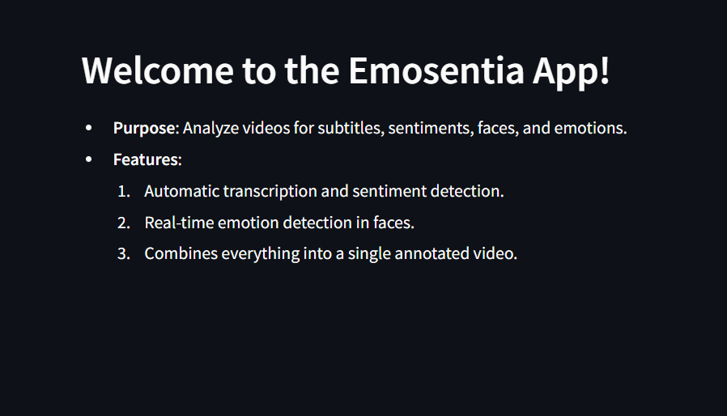

# 🎥 Emosentia: AI-Powered Video Emotion and Sentiment Analysis

**Emosentia** is an intelligent video analysis tool built with **Whisper**, **Transformers**, **MediaPipe**, **MoviePy**, and **Streamlit**. It provides a unified pipeline for:

- 🎙️ **Live Captioning** using Whisper ASR
- 😊 **Sentiment Analysis** using HuggingFace Transformers
- 😃 **Facial Emotion Detection** using MediaPipe & FER
- 🧠 **Annotated Final Video** with overlays using MoviePy


---

## 🔧 Features

✅ **Speech-to-Text Transcription**  
Uses OpenAI’s Whisper model to extract text captions from audio in video files.

✅ **Sentiment Analysis**  
Performs segment-wise sentiment detection using `cardiffnlp/twitter-roberta-base-sentiment`.

✅ **Facial Emotion Recognition**  
Detects faces and recognizes emotional expressions using MediaPipe and the FER library.

✅ **Subtitle + Sentiment Overlay**  
Creates a final video overlaying captions at the bottom and sentiment labels at the top-left, along with emotion-labeled face boxes.

✅ **Streamlit Web App**  
Simple user interface to upload videos and download final processed outputs.

---

## 🛠️ Tech Stack

| Component         | Library/Model                                 |
|------------------|------------------------------------------------|
| Speech to Text    | `whisper` (OpenAI Whisper Medium Model)       |
| Sentiment Analysis| `transformers` + `cardiffnlp` RoBERTa         |
| Face Detection    | `mediapipe`                                   |
| Emotion Detection | `FER` with MTCNN                              |
| Video Processing  | `moviepy`, `opencv-python`, `ffmpeg`          |
| UI                | `streamlit`                                   |


---

## 🚀 How It Works

1. **Upload a video file (MP4, AVI, MOV)**.
2. **Whisper** transcribes the audio and segments it.
3. Each segment is passed to a **sentiment classifier**.
4. The video is scanned frame-by-frame to detect **faces and emotions**.
5. Using **MoviePy**, all insights are overlaid on the original video:
   - Captions (bottom)
   - Sentiments (top-left)
   - Face bounding boxes + detected emotions

---

## 📦 Installation

```bash
git clone https://github.com/your-username/emosentia.git
cd emosentia

# Install dependencies
pip install -r requirements.txt

# Additional setup
# For Whisper
pip install git+https://github.com/openai/whisper.git

# For FFmpeg (ensure it's in PATH)
# For ImageMagick (set path in MoviePy if on Windows)
````

---

## 📂 Usage

```bash
streamlit run app.py
```

Then go to `http://localhost:8501` in your browser.

---

## 🧪 Sample Output

* 🎬 Final video with subtitles and emotion boxes
* 🗂️ Generated `.vtt` file with timestamps, captions, and sentiment labels
* 📥 Downloadable final processed video

---

## 📁 Folder Structure

```
Video_Analysis/
├── final.py                  # Streamlit frontend + main logic
├── Captions.py             # Shows up only the captions of the video
├── requirements.txt        # Python dependencies
├── /videos                 # Uploaded and processed videos
└── README.md               # You are here
```

---

## 💡 Future Enhancements

* Real-time webcam-based emotion tracking
* Multilingual transcription
* Scene change detection and tagging
* Deepfake/spoof face detection

---

## 🤖 Credits

* [OpenAI Whisper](https://github.com/openai/whisper)
* [Hugging Face Transformers](https://huggingface.co/)
* [MediaPipe by Google](https://mediapipe.dev/)
* [FER Emotion Detector](https://github.com/justinshenk/fer)
* [MoviePy](https://zulko.github.io/moviepy/)
* [Streamlit](https://streamlit.io/)

---
